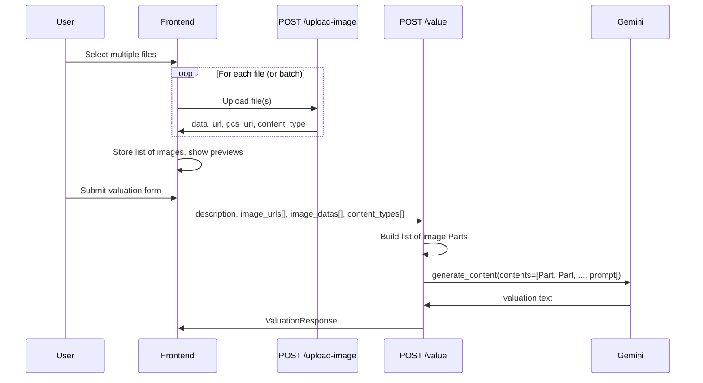

# Multiple image upload support

## Current behavior

- **Backend**: `[server.py](e:\ai-appraiser\server.py)` has a single-image flow: `/upload-image` accepts one file and returns one `data_url`/`gcs_uri`; `/value` accepts one `image_url` or one `image_data`/`content_type`; `estimate_value()` builds Gemini `contents` with a single image `Part` plus the prompt.
- **Frontend**: `[index.html](e:\ai-appraiser\index.html)` uses one file input, one preview area, and one set of hidden fields (`image_url`, `image_data`, `content_type`) for the valuation form.
- **Tests**: `[test_server.py](e:\ai-appraiser\test_server.py)` assert single-file upload and single-image valuation.

## Architecture after changes

## 1. Backend (`[server.py](e:\ai-appraiser\server.py)`)

### 1.1 Upload endpoint

- **Option A (minimal change):** Keep `/upload-image` as single-file. Frontend calls it once per selected file (e.g. on `change` with `multiple`, or via a small JS loop). No backend change.
- **Option B (batch):** Add a new endpoint (e.g. `POST /upload-images`) that accepts `List[UploadFile]` via `File(...)`, loops over each, and returns a list of `{data_url, gcs_uri, content_type}`. Keep existing `/upload-image` for compatibility.

Recommendation: **Option A** for simplicity; Option B if you want one round-trip for many files.

### 1.2 Valuation: `estimate_value()`

- Change signature to accept **sequences** of image inputs instead of a single one:
  - e.g. `image_uris: list[str] | None = None` and `image_data_list: list[tuple[bytes, str]] | None = None` (bytes + mime_type per image).
- Require at least one image (either non-empty `image_uris` or `image_data_list`).
- Build Gemini `contents` as: **all image parts first** (in order), then the text prompt:
  - For URIs: `Part.from_uri(file_uri=uri, mime_type=...)` for each.
  - For inline data: `Part.from_bytes(data=bytes, mime_type=mime_type)` for each.
- Update the prompt wording if desired (e.g. “images” instead of “image”). Gemini supports multiple image parts in one `generate_content` call.

### 1.3 Valuation: `/value` endpoint

- Replace single `image_url`, `image_data`, `content_type` with:
  - `image_urls: list[str] = Form([])`
  - `image_datas: list[str] = Form([])` (data URL strings)
  - `content_types: list[str] = Form([])`
- Validation: require `len(image_urls) + len(image_datas) >= 1`. For each entry in `image_datas`, decode base64 and pair with corresponding `content_types` (use same index; default `content_types[i]` to `"image/jpeg"` if missing).
- Build two lists for `estimate_value`: (1) URIs from `image_urls`, (2) `(decoded_bytes, mime_type)` from `image_datas`/`content_types`. Pass both into `estimate_value` so it can build the combined list of parts (e.g. all URIs first, then all inline images, preserving order).
- **Backward compatibility:** If you want old clients (single image) to keep working, you can still accept optional single `image_url` / `image_data` / `content_type` and, when present, merge them into the lists so the rest of the pipeline is list-based.

## 2. Frontend (`[index.html](e:\ai-appraiser\index.html)`)

### 2.1 File input and upload

- Add the `multiple` attribute to the file input: `<input ... type="file" multiple />`.
- **If keeping single-file upload (Option A):** On `change`, iterate over `files` and for each file send a separate `hx-post="/upload-image"`. HTMX typically posts one file per request, so you’ll need to switch to JS: use `fetch("/upload-image", { method: "POST", body: formData })` for each file (or one by one), then update preview and state for each response. Alternatively, use a custom trigger that posts the first file and clears the input, and repeat until no files left (more complex). **Simpler approach:** use a small script that on file selection builds a `FormData` per file, posts to `/upload-image`, and appends each returned image to the “uploaded images” state and preview.
- **If adding batch upload (Option B):** Use one `FormData` with multiple keys (e.g. `image_files`) and `POST` to `/upload-images`, then process the returned list to update previews and state.

### 2.2 State and preview

- Replace single `imageData`/`contentType` (and single `image_url`) with **arrays**: e.g. `uploadedImages = [{ dataUrl, gcsUri, contentType }, ...]`.
- Preview area: render **multiple** thumbnails (e.g. a flex/grid of small images), each with an optional “remove” control that splices that item out of `uploadedImages` and re-renders.

### 2.3 Valuation form submission

- Remove the single hidden inputs `image_url`, `image_data`, `content_type`.
- Add **repeated** hidden inputs for the list: e.g. before submit, or when building the form, ensure there are `image_urls` and/or `image_datas`/`content_types` for each entry. With HTMX, you can dynamically create hidden inputs with the same name for each image (e.g. one `name="image_urls"` per GCS URI, one `name="image_datas"` per data URL, one `name="content_types"` per type). FastAPI will receive these as `list[str]`.
- Ensure at least one image is present before submit (same as now, but for the list).
- Reset: clear `uploadedImages`, re-show dropzone, clear all dynamic hidden inputs and the results area.

### 2.4 UX copy

- Update any text that says “an image” to “one or more images” where relevant.

## 3. Tests (`[test_server.py](e:\ai-appraiser\test_server.py)`)

### 3.1 Upload

- **Option A:** Add a test that uploads multiple files by calling `POST /upload-image` multiple times and asserting each response; or leave as-is if behavior is unchanged.
- **Option B:** Add tests for `POST /upload-images` with 0, 1, and N files; assert response list length and structure.

### 3.2 `estimate_value()`

- Add a test that passes **multiple** `image_uris` or multiple (bytes, mime_type) and assert that `generate_content` is called with `contents` containing multiple image parts followed by the prompt.
- Keep existing single-image tests; optionally add a test that passes a single image via the new list parameters to ensure backward compatibility.

### 3.3 `/value` endpoint

- Test with **multiple** `image_urls` (e.g. two GCS URIs) and assert success and that `estimate_value` receives both.
- Test with **multiple** `image_datas` and `content_types` (same length) and assert decoding and forwarding to `estimate_value`.
- Test with **mixed** (some `image_urls`, some `image_datas`) if the backend supports that ordering.
- Test **no images** (empty lists) returns 400.
- Adjust existing tests that send single `image_url`/`image_data` to use the new list parameters (e.g. `image_urls=["gs://..."]` or `image_datas=["data:image/jpeg;base64,..."]`, `content_types=["image/jpeg"]`).

### 3.4 Integration-style test

- Update the integration-style test to pass multiple images (e.g. two image_data entries) and assert the mock is called with multiple parts and the response is returned correctly.

## 4. Order of implementation

1. **Backend first:** Change `estimate_value()` to accept and merge multiple image URIs and multiple (bytes, mime_type); build multi-part `contents`; add tests for `estimate_value` with multiple images.
2. **Backend `/value`:** Switch to list form params, validate, decode, and call updated `estimate_value`; add/update tests for `/value` with multiple images and edge cases.
3. **Frontend:** Multi-file input, per-file or batch upload, array state, multiple previews, form with repeated hidden fields, and reset.
4. **Upload endpoint (optional):** Add batch upload and tests only if choosing Option B.

## 5. Edge cases to handle

- **Empty selection:** Require at least one image (backend 400, frontend “Please upload at least one image”).
- **Mismatched lengths:** If using parallel lists for `image_datas` and `content_types`, use `content_types[i]` with a safe default when index is out of range.
- **Large payloads:** Many large data URLs can make the form huge; prefer sending GCS URIs when available (upload first, then submit with `image_urls` only) to avoid base64 bloat.
- **GCS:** Existing `upload_image_to_gcs` stays per-file; no change unless you add a batch upload helper that calls it in a loop.

